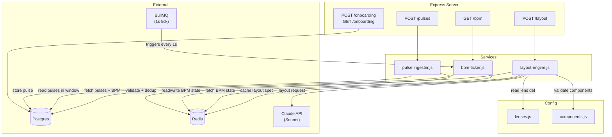

# Design Document — Dashboard API

## Overview

The Dashboard API is the backend data and computation layer for the jp-system Founder SIEM dashboard. It exposes four route groups (`/pulses`, `/bpm`, `/layout`, `/onboarding`) over Express, backed by Postgres for immutable pulse storage, Redis for BPM tick state and deduplication, BullMQ for the 1-second BPM tick job, and Claude API (Sonnet) for AI-driven layout spec generation.

The API has no UI responsibility. The frontend consumes all data through these endpoints. For v1.0, all seven pulse sources are simulated — real webhook integrations are post-v1.0.

### Key Design Decisions

- **BPM on fixed tick, not on pulse arrival.** BPM is computed every 1 second by a BullMQ repeatable job. This decouples computation from ingestion, prevents BPM spikes from burst ingestion, and gives the frontend a stable polling target.
- **Claude generates layout specs, not HTML.** Claude selects and configures components from a fixed library. The renderer (frontend) assembles them. This keeps the UI bounded and consistent.
- **Validation is ordered and strict.** Pulse ingestion validates in a fixed pipeline: schema version → canonical schema → dedup → store. No partial acceptance.
- **Layout validation is strict with one retry.** JSON parse → structural schema → component library check. Retry once on any failure. No partial specs returned.
- **Heart is a system component.** It is always rendered by the frontend, never referenced in layout specs, and not in the component library.
- **Dedup is scoped to (id, source) pair.** Two different sources emitting the same UUID are treated as distinct pulses.
- **Out-of-order pulses accepted.** Sorting happens at read time, not at ingest time.

## Architecture



### Request Flow

1. **Pulse ingestion:** `POST /pulses` → `pulse-ingester.js` → schema version check → canonical schema validation → Redis dedup check (id+source, 300s window) → Postgres insert.
2. **BPM read:** `GET /bpm` → `bpm-ticker.js` reads latest computed BPM from Redis (written by the BullMQ tick job every 1s).
3. **Layout generation:** `POST /layout` → `layout-engine.js` checks Redis cache (30s TTL, keyed by lens_id) → on miss: loads lens from `lenses.js`, fetches recent pulses from Postgres, fetches BPM from Redis, calls Claude API, validates response (JSON → structure → components), caches result, returns spec.
4. **Onboarding:** `POST /onboarding` writes max_bpm to Postgres. `GET /onboarding` reads current state.

### File Structure

```
api/
├── src/
│   ├── routes/
│   │   ├── pulses.js        # POST /pulses
│   │   ├── bpm.js           # GET /bpm
│   │   ├── layout.js        # POST /layout
│   │   └── onboarding.js    # POST /onboarding, GET /onboarding
│   ├── services/
│   │   ├── pulse-ingester.js # validation, dedup, store
│   │   ├── bpm-ticker.js     # BullMQ tick, BPM computation, zone calc
│   │   └── layout-engine.js  # Claude call, spec validation, caching
│   └── config/
│       ├── lenses.js         # lens definitions (founder, ciso, investor, board)
│       └── components.js     # component library registry
├── package.json
└── index.js                  # Express app bootstrap
```


## Components and Interfaces

### Route: `POST /pulses` — `api/src/routes/pulses.js`

Accepts a JSON body conforming to the canonical pulse schema. Delegates to `pulse-ingester.js`.

**Request body:**
```json
{
  "id": "uuid",
  "timestamp": "ISO8601",
  "source": "string",
  "type": "event | metric | state | alert",
  "entity_type": "project | user | vendor | system",
  "entity_id": "string",
  "severity": "info | warning | critical",
  "payload": {},
  "tags": ["string"],
  "schema_version": "1.0"
}
```

**Responses:**
| Status | Condition |
|--------|-----------|
| `201` | Pulse accepted and stored |
| `400` | Schema version unsupported, or canonical schema validation failed |
| `409` | Duplicate (id, source) within 300s dedup window |

### Route: `GET /bpm` — `api/src/routes/bpm.js`

Returns the latest BPM snapshot computed by the ticker.

**Response body:**
```json
{
  "current": 42,
  "baseline": 20,
  "max": 80,
  "zone": 2,
  "window_seconds": 60
}
```

- `baseline` is static `20` for v1.0.
- `max` comes from onboarding (default `60` until set).
- `zone` is `1–5`, derived from `(current / max) * 100`.

### Route: `POST /layout` — `api/src/routes/layout.js`

Requests a layout spec for a given lens.

**Request body:**
```json
{
  "lens_id": "founder | ciso | investor | board"
}
```

**Response body (success):**
```json
{
  "lens": "investor",
  "bpm_zone": 3,
  "summary": "Build velocity is elevated this week.",
  "layout": [
    {
      "component": "MetricCard",
      "title": "Trust Score",
      "signal": "proof360.score.latest",
      "trend": "up"
    }
  ]
}
```

**Responses:**
| Status | Condition |
|--------|-----------|
| `200` | Valid layout spec returned (from cache or fresh Claude call) |
| `400` | Invalid or missing `lens_id` |
| `502` | Claude API returned invalid spec after retry |

**Empty stream fallback (zero pulses in window):**
```json
{
  "lens": "<requested_lens_id>",
  "bpm_zone": 1,
  "summary": "No recent activity",
  "layout": [
    {
      "component": "AlertFeed",
      "title": "Activity",
      "message": "No recent activity"
    }
  ]
}
```
This fallback is never cached.

### Route: `POST /onboarding` and `GET /onboarding` — `api/src/routes/onboarding.js`

**POST request body:**
```json
{ "max_bpm": 80 }
```

**POST response:** `200` with `{ "max_bpm": 80, "status": "configured" }`

**GET response:**
```json
{
  "max_bpm": 80,
  "configured": true
}
```
If not yet configured: `{ "max_bpm": 60, "configured": false }` (default 60).

### Service: `pulse-ingester.js` — `api/src/services/pulse-ingester.js`

**Interface:**
```js
async function ingestPulse(pulseBody) → { stored: true, pulse } | throws ValidationError | DuplicateError
```

**Validation pipeline (strict order):**
1. **Schema version check** — reject if `schema_version` not in `["1.0"]`
2. **Canonical schema enforcement** — validate all required fields present and typed correctly:
   - `id`: non-empty string (UUID format)
   - `timestamp`: valid ISO8601
   - `source`: non-empty string
   - `type`: one of `event`, `metric`, `state`, `alert`
   - `entity_type`: one of `project`, `user`, `vendor`, `system`
   - `entity_id`: non-empty string
   - `severity`: one of `info`, `warning`, `critical`
   - `payload`: object
   - `tags`: array of strings
   - `schema_version`: string
3. **Dedup check** — Redis `SET` with key `dedup:{id}:{source}`, TTL 300s. If key exists, reject as duplicate.
4. **Store** — Insert into Postgres `pulses` table. Fields are immutable after write.

### Service: `bpm-ticker.js` — `api/src/services/bpm-ticker.js`

**Interface:**
```js
// Called by BullMQ every 1 second
async function tick() → void  // computes BPM, writes to Redis

// Called by GET /bpm route
async function getCurrentBPM() → { current, baseline, max, zone, window_seconds }
```

**Computation:**
1. Query Postgres for pulses where `timestamp >= now - window_seconds`, ordered by `timestamp ASC, id ASC`.
2. `current_bpm = Math.max(1, Math.round(count / window_seconds * 60))` — floor of 1, never zero.
3. Read `max_bpm` from Redis/Postgres (default 60 if not set).
4. `percentage = (current_bpm / max_bpm) * 100`
5. Zone thresholds:
   - `0–50%` → Zone 1
   - `50–65%` → Zone 2
   - `65–75%` → Zone 3
   - `75–90%` → Zone 4
   - `90–100%` → Zone 5
6. Write `{ current, baseline: 20, max, zone, window_seconds }` to Redis key `bpm:current`.

### Service: `layout-engine.js` — `api/src/services/layout-engine.js`

**Interface:**
```js
async function generateLayout(lensId) → LayoutSpec | throws LayoutError
```

**Flow:**
1. Check pulse count in window. If zero → return empty-stream fallback (not cached).
2. Check Redis cache key `layout:{lensId}`. If hit and TTL valid → return cached spec.
3. Load lens definition from `lenses.js`.
4. Fetch recent pulses from Postgres (within rolling window, sorted `timestamp ASC, id ASC`).
5. Fetch current BPM snapshot from Redis.
6. Build Claude API payload per the prompt contract in `dashboard-ai-spec.md`.
7. Call Claude API with the exact system prompt.
8. **Validate response (3-step):**
   - Step 1: JSON parse. If fails → retry once.
   - Step 2: Structural schema check (`lens`, `bpm_zone`, `summary`, `layout` array required). If fails → retry once.
   - Step 3: Component library check (every `component` field in `layout` array must exist in `components.js`). If fails → retry once.
9. On retry failure at any step → throw `LayoutError` (maps to 502).
10. On success → cache in Redis with key `layout:{lensId}`, TTL 30s. Return spec.

**Lens switch:** When `lensId` differs from the cached key, the old cache entry is irrelevant (different key). Fresh Claude call happens naturally.

### Config: `lenses.js` — `api/src/config/lenses.js`

Exports an object keyed by lens ID. Each lens definition:

```js
{
  id: 'founder',
  label: 'Founder',
  prompt_context: 'Everything. Full system read. BPM + all zones visible.',
  severity_weights: { info: 1, warning: 1, critical: 1 },
  source_weights: { github: 1, stripe: 1, auth0: 1, hubspot: 1, proof360: 1, system: 1, aws: 1 },
  max_components: 8
}
```

Four built-in lenses: `founder`, `ciso`, `investor`, `board` — definitions per `dashboard-ai-spec.md`.

### Config: `components.js` — `api/src/config/components.js`

Exports the component library as a set/array for validation:

```js
const COMPONENT_LIBRARY = [
  'MetricCard', 'StatusGrid', 'AlertFeed', 'HealthBar',
  'ActivitySparkline', 'PeopleCard', 'GapCard', 'LifecycleBoard',
  'BPMChart', 'SecretRotation', 'CostTracker', 'PipelineMetric'
];
```

The Heart is explicitly excluded — it is a system-level UI element rendered unconditionally by the frontend.


## Data Models

### Postgres: `pulses` table

```sql
CREATE TABLE pulses (
  id            UUID PRIMARY KEY,
  timestamp     TIMESTAMPTZ NOT NULL,
  source        TEXT NOT NULL,
  type          TEXT NOT NULL CHECK (type IN ('event', 'metric', 'state', 'alert')),
  entity_type   TEXT NOT NULL CHECK (entity_type IN ('project', 'user', 'vendor', 'system')),
  entity_id     TEXT NOT NULL,
  severity      TEXT NOT NULL CHECK (severity IN ('info', 'warning', 'critical')),
  payload       JSONB NOT NULL DEFAULT '{}',
  tags          TEXT[] NOT NULL DEFAULT '{}',
  schema_version TEXT NOT NULL,
  ingested_at   TIMESTAMPTZ NOT NULL DEFAULT NOW()
);

-- Index for BPM window queries (timestamp range scans)
CREATE INDEX idx_pulses_timestamp ON pulses (timestamp DESC);

-- Index for dedup verification (belt-and-suspenders alongside Redis)
CREATE INDEX idx_pulses_id_source ON pulses (id, source);
```

**Immutability:** No `UPDATE` or `DELETE` operations are exposed through the API. The `pulse-ingester.js` service only performs `INSERT`. Fields `severity`, `tags`, `entity_type`, and `entity_id` are set exactly once at ingest and never mutated.

### Postgres: `onboarding` table

```sql
CREATE TABLE onboarding (
  id          SERIAL PRIMARY KEY,
  max_bpm     INTEGER NOT NULL DEFAULT 60,
  configured  BOOLEAN NOT NULL DEFAULT FALSE,
  updated_at  TIMESTAMPTZ NOT NULL DEFAULT NOW()
);

-- Single row — upsert pattern
INSERT INTO onboarding (id, max_bpm, configured) VALUES (1, 60, FALSE)
ON CONFLICT (id) DO NOTHING;
```

### Redis Keys

| Key | Type | TTL | Purpose |
|-----|------|-----|---------|
| `dedup:{id}:{source}` | String (`1`) | 300s | Dedup window for (id, source) pair |
| `bpm:current` | Hash | None (overwritten every 1s) | Latest BPM snapshot: `current`, `baseline`, `max`, `zone`, `window_seconds` |
| `bpm:max` | String | None | Founder's max_bpm (mirrors Postgres for fast read) |
| `layout:{lensId}` | String (JSON) | 30s | Cached layout spec per lens |

### BullMQ Job

| Queue | Job Name | Repeat | Concurrency |
|-------|----------|--------|-------------|
| `bpm-tick` | `compute-bpm` | Every 1000ms | 1 |

The BullMQ repeatable job triggers `bpm-ticker.tick()` every second. Concurrency is 1 — only one tick computation runs at a time.

### Lens Definition Shape

```typescript
interface Lens {
  id: string;              // 'founder' | 'ciso' | 'investor' | 'board'
  label: string;           // display name
  prompt_context: string;  // what this audience cares about
  severity_weights: Record<'info' | 'warning' | 'critical', number>;
  source_weights: Record<string, number>;
  max_components: number;  // max components Claude may place
}
```

### Layout Spec Shape (Claude Response)

```typescript
interface LayoutSpec {
  lens: string;
  bpm_zone: number;        // 1–5
  summary: string;         // one sentence max
  layout: LayoutComponent[];
}

interface LayoutComponent {
  component: string;       // must exist in COMPONENT_LIBRARY
  title: string;
  [key: string]: any;      // component-specific config (signal, filter, trend, etc.)
}
```

### Claude API Payload (sent to Claude)

```typescript
interface ClaudeLayoutRequest {
  lens: Lens;
  recent_pulses: Pulse[];
  current_bpm: number;
  bpm_zone: number;
  system_baseline_bpm: number;  // static 20 for v1.0
  available_components: string[];
}
```


## Correctness Properties

*A property is a characteristic or behavior that should hold true across all valid executions of a system — essentially, a formal statement about what the system should do. Properties serve as the bridge between human-readable specifications and machine-verifiable correctness guarantees.*

### Property 1: Schema validation rejects invalid pulses

*For any* pulse object where `schema_version` is not in the supported list `["1.0"]`, OR where any required field (`id`, `timestamp`, `source`, `type`, `entity_type`, `entity_id`, `severity`, `payload`, `tags`, `schema_version`) is missing or has an invalid type/value, the Pulse_Ingester SHALL reject the pulse with a validation error.

**Validates: Requirements 1.1, 1.7**

### Property 2: Validation order is enforced

*For any* pulse that would fail multiple validation stages (e.g., unsupported schema_version AND missing required fields AND duplicate id+source), the Pulse_Ingester SHALL return the error corresponding to the first failing stage in the fixed order: schema version → canonical schema → dedup → store.

**Validates: Requirements 1.5**

### Property 3: Pulse storage round trip

*For any* valid, non-duplicate pulse that passes all validation stages, storing it and then reading it back from Postgres SHALL return a record with identical values for all fields (`id`, `timestamp`, `source`, `type`, `entity_type`, `entity_id`, `severity`, `payload`, `tags`, `schema_version`). These fields are immutable after write.

**Validates: Requirements 1.3, 1.4**

### Property 4: Dedup rejects duplicate (id, source) pairs

*For any* valid pulse, if it is ingested successfully and then submitted again with the same (`id`, `source`) pair within 300 seconds, the second submission SHALL be rejected as a duplicate. Conversely, the same `id` with a different `source` SHALL be treated as a distinct pulse and accepted.

**Validates: Requirements 1.2**

### Property 5: BPM formula correctness

*For any* set of pulses with timestamps within the rolling window, the computed BPM SHALL equal `max(1, round(count / window_seconds * 60))`. The BPM is never zero — the floor is 1.

**Validates: Requirements 2.2, 2.4**

### Property 6: Pulse ordering within window

*For any* set of pulses queried within the rolling window, the result SHALL be sorted by `timestamp` ascending, then by `id` ascending as a tie-breaker.

**Validates: Requirements 2.5**

### Property 7: Zone calculation from BPM percentage

*For any* `current_bpm` and `max_bpm` (both positive integers), the zone SHALL be derived from `(current_bpm / max_bpm) * 100` mapped to: Zone 1 for 0–50%, Zone 2 for 50–65%, Zone 3 for 65–75%, Zone 4 for 75–90%, Zone 5 for 90–100%.

**Validates: Requirements 3.1**

### Property 8: Onboarding max_bpm round trip and zone recalibration

*For any* positive integer `max_bpm` posted to the onboarding endpoint, the stored value SHALL be readable via GET /onboarding, and the next BPM computation SHALL use the new `max_bpm` for zone calculation.

**Validates: Requirements 3.3, 6.2**

### Property 9: Layout validation rejects invalid specs

*For any* Claude API response that is either (a) not valid JSON, (b) missing required structural fields (`lens`, `bpm_zone`, `summary`, `layout` array), or (c) references a component not in the Component_Library, the Layout_Engine SHALL reject the spec. No partial specs are ever returned — the response is either fully valid or an explicit error.

**Validates: Requirements 4.5, 4.6, 4.7, 4.10**

### Property 10: Layout validation retries once then errors

*For any* invalid Claude API response (malformed JSON, invalid structure, or unknown component), the Layout_Engine SHALL retry the Claude API call exactly once. If the retry also produces an invalid response, the engine SHALL return an error without substituting components or returning partial results.

**Validates: Requirements 4.8, 4.9**

### Property 11: Claude API payload contains all required fields

*For any* layout request with a valid lens_id and non-empty pulse stream, the payload sent to Claude API SHALL contain: the lens definition, recent pulses (sorted timestamp ASC, id ASC), current BPM, BPM zone, system baseline BPM (20), and the list of available components from the Component_Library.

**Validates: Requirements 4.2, 4.3**

### Property 12: Lens cache invalidation on switch

*For any* two consecutive layout requests with different `lens_id` values, the second request SHALL trigger a fresh Claude API call regardless of whether the first result is still within its 30-second TTL.

**Validates: Requirements 5.2**

### Property 13: Same-lens cache TTL

*For any* two consecutive layout requests with the same `lens_id` within 30 seconds, the second request SHALL return the cached Layout_Spec without making a new Claude API call.

**Validates: Requirements 5.3**

### Property 14: Lens definitions contain all required fields

*For any* lens in the configuration (`founder`, `ciso`, `investor`, `board`), the definition SHALL contain all required fields: `id`, `label`, `prompt_context`, `severity_weights`, `source_weights`, and `max_components`.

**Validates: Requirements 5.4**

### Property 15: Simulated pulses conform to canonical schema and source types

*For any* simulated pulse generated by the simulator, the pulse SHALL pass the same canonical schema validation that real pulses go through. Additionally, for each source, the generated `type` and `payload` SHALL be appropriate for that source (e.g., `github` generates commits/PRs/deployments/issues).

**Validates: Requirements 7.2, 7.3, 7.4, 7.5, 7.6, 7.7, 7.8, 7.9**


## Error Handling

### Pulse Ingestion Errors

| Error | HTTP Status | Response Body | Recovery |
|-------|-------------|---------------|----------|
| Unsupported `schema_version` | `400` | `{ "error": "unsupported_schema_version", "supported": ["1.0"] }` | Caller fixes version and resubmits |
| Missing or invalid required field | `400` | `{ "error": "schema_validation_failed", "details": "<field>: <reason>" }` | Caller fixes payload |
| Duplicate `(id, source)` within 300s | `409` | `{ "error": "duplicate_pulse", "id": "<id>", "source": "<source>" }` | Caller discards — pulse already stored |
| Postgres write failure | `500` | `{ "error": "storage_error" }` | Retry at caller discretion; dedup key already set so re-submission within 300s will be rejected — caller should use a new `id` |

**Validation order is strict.** A pulse with both an unsupported schema_version and a duplicate id will receive the schema_version error, not the duplicate error.

### BPM Errors

| Error | HTTP Status | Response Body | Recovery |
|-------|-------------|---------------|----------|
| Redis unavailable (no cached BPM) | `503` | `{ "error": "bpm_unavailable" }` | Frontend retries on next poll cycle |
| Postgres query failure during tick | N/A (internal) | Logged, previous BPM value retained in Redis | Next tick retries automatically |

The BPM ticker is resilient — if a single tick fails, the previous BPM value remains in Redis. The frontend always gets the last successful computation.

### Layout Engine Errors

| Error | HTTP Status | Response Body | Recovery |
|-------|-------------|---------------|----------|
| Invalid `lens_id` | `400` | `{ "error": "invalid_lens_id", "valid": ["founder", "ciso", "investor", "board"] }` | Caller uses valid lens_id |
| Claude API timeout or network error | `502` | `{ "error": "layout_generation_failed", "reason": "claude_unavailable" }` | Frontend shows stale cached layout or fallback UI |
| Claude returns invalid JSON (after retry) | `502` | `{ "error": "layout_generation_failed", "reason": "invalid_response" }` | Frontend shows fallback UI |
| Claude returns invalid component (after retry) | `502` | `{ "error": "layout_generation_failed", "reason": "invalid_component" }` | Frontend shows fallback UI |

**Retry policy:** Exactly one retry on any validation failure (malformed JSON, invalid structure, unknown component). No retry on network/timeout errors — those fail immediately.

**No partial specs.** The layout engine never returns a layout spec with some components stripped out. It's all-or-nothing.

### Onboarding Errors

| Error | HTTP Status | Response Body | Recovery |
|-------|-------------|---------------|----------|
| Missing or non-integer `max_bpm` | `400` | `{ "error": "invalid_max_bpm" }` | Caller fixes payload |
| `max_bpm` <= 0 | `400` | `{ "error": "invalid_max_bpm", "reason": "must be positive integer" }` | Caller fixes value |
| Postgres write failure | `500` | `{ "error": "storage_error" }` | Caller retries |

### General Error Handling Principles

- All errors return JSON with an `error` field. No HTML error pages.
- 4xx errors include enough detail for the caller to fix the request.
- 5xx errors log full details server-side but return minimal info to the caller.
- The BPM ticker and pulse simulator run as background jobs — their errors are logged but do not surface as HTTP errors.

## Testing Strategy

### Dual Testing Approach

The Dashboard API uses both unit tests and property-based tests. They are complementary:

- **Unit tests** verify specific examples, edge cases, integration points, and error conditions.
- **Property-based tests** verify universal properties across randomly generated inputs, catching bugs that specific examples miss.

### Property-Based Testing

**Library:** [fast-check](https://github.com/dubzzz/fast-check) — the standard property-based testing library for JavaScript/TypeScript.

**Configuration:**
- Minimum 100 iterations per property test
- Each property test references its design document property with a tag comment
- Tag format: `Feature: dashboard-api, Property {number}: {property_text}`

**Each correctness property (Properties 1–15) maps to exactly one property-based test.**

### Unit Tests

Unit tests focus on:
- **Specific examples:** A valid pulse is stored and readable. A known duplicate is rejected.
- **Edge cases:** Empty pulse stream returns BPM 1 (Zone 1 floor). Zero pulses returns AlertFeed fallback. Out-of-order timestamps accepted.
- **Integration points:** BullMQ tick triggers BPM computation. Redis cache hit/miss for layout specs. Claude API mock returns expected payloads.
- **Error conditions:** Postgres unavailable during write. Redis unavailable during dedup check. Claude API timeout.

### Test Organization

```
api/
├── tests/
│   ├── unit/
│   │   ├── pulse-ingester.test.js
│   │   ├── bpm-ticker.test.js
│   │   ├── layout-engine.test.js
│   │   ├── zone-calculation.test.js
│   │   └── onboarding.test.js
│   ├── property/
│   │   ├── pulse-validation.property.js    # Properties 1, 2, 3, 4
│   │   ├── bpm-computation.property.js     # Properties 5, 6
│   │   ├── zone-calculation.property.js    # Property 7
│   │   ├── onboarding.property.js          # Property 8
│   │   ├── layout-validation.property.js   # Properties 9, 10, 11
│   │   ├── layout-caching.property.js      # Properties 12, 13
│   │   ├── lens-config.property.js         # Property 14
│   │   └── simulator.property.js           # Property 15
│   └── integration/
│       ├── pulse-flow.test.js              # End-to-end: ingest → BPM → layout
│       └── onboarding-flow.test.js         # Onboarding → zone recalibration
```

### Property-to-Test Mapping

| Property | Test File | What It Generates |
|----------|-----------|-------------------|
| 1: Schema validation rejects invalid pulses | `pulse-validation.property.js` | Random pulse objects with missing/invalid fields and unsupported schema versions |
| 2: Validation order is enforced | `pulse-validation.property.js` | Pulses that fail at multiple stages, verify first-stage error |
| 3: Pulse storage round trip | `pulse-validation.property.js` | Valid pulses, store then read back, compare all fields |
| 4: Dedup rejects duplicate (id, source) pairs | `pulse-validation.property.js` | Random (id, source) pairs, submit twice, verify rejection; same id different source accepted |
| 5: BPM formula correctness | `bpm-computation.property.js` | Random pulse sets with random timestamps, verify formula |
| 6: Pulse ordering within window | `bpm-computation.property.js` | Random pulse sets, verify sort order |
| 7: Zone calculation from BPM percentage | `zone-calculation.property.js` | Random (current_bpm, max_bpm) pairs, verify zone thresholds |
| 8: Onboarding max_bpm round trip | `onboarding.property.js` | Random positive integers, post then verify GET and zone recalc |
| 9: Layout validation rejects invalid specs | `layout-validation.property.js` | Random invalid JSON, missing fields, unknown components |
| 10: Layout validation retries once then errors | `layout-validation.property.js` | Mock Claude returning invalid responses twice |
| 11: Claude API payload contains all required fields | `layout-validation.property.js` | Random lens + pulse combinations, inspect payload |
| 12: Lens cache invalidation on switch | `layout-caching.property.js` | Random lens_id sequences, verify cache miss on change |
| 13: Same-lens cache TTL | `layout-caching.property.js` | Same lens_id repeated within 30s, verify cache hit |
| 14: Lens definitions contain all required fields | `lens-config.property.js` | Iterate all lens configs, verify field presence |
| 15: Simulated pulses conform to schema | `simulator.property.js` | Generate many simulated pulses, validate each against canonical schema |

### Test Runner

- **Jest** as the test runner (standard for Node.js/Express projects)
- `fast-check` integrated via `fc.assert(fc.property(...))` within Jest test blocks
- Integration tests use in-memory Postgres (via `pg-mem`) and mock Redis (via `ioredis-mock`) to avoid external dependencies
- Claude API calls mocked in all tests except dedicated integration smoke tests
